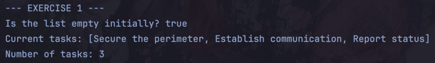
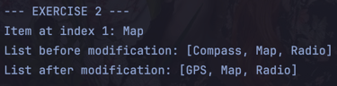
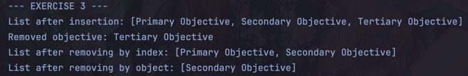
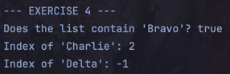
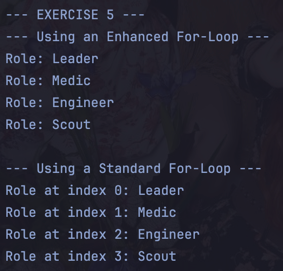
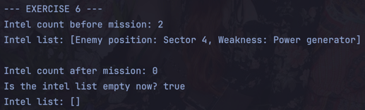

# Exploring Java Arraylist

## Warren Denzel F. Cheng

## Introduction
This repository contains a Java exercises to explore the use cases of Java `ArrayList`.

## Exercises
1. **Creating an ArrayList and Adding Elements (add)**

  

2. **Accessing and Modifying Elements (get and set)**

  

3. **Inserting and Removing Elements (add at index and remove)**

  

4. **Searching the List (contains and indexOf)**

  

5. **Iterating Through the List**

  

6. **Clearing the List (clear)**

  
